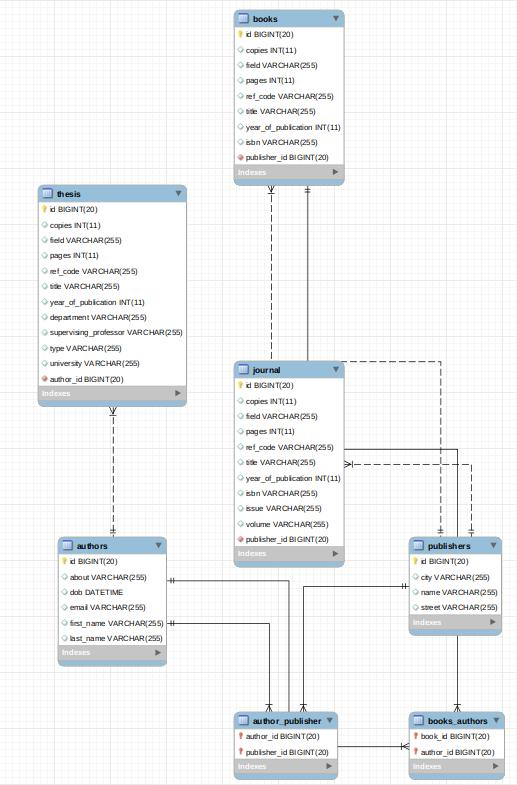

# ils

  

 <h4>An Intergrated Library System demo, using Spring Boot framework for serving the REST API and React Js for bulding a single page application client. </h4>
 
 This API exposes the following endpoints for CRUD requests:
 * /authors
 * /publishers
 * /books
 * /journals
 * /theses
 
The scema of the database : 
 

 
* Ils is online at [https://pamak-ils.herokuapp.com/](https://pamak-ils.herokuapp.com/) . You can start by adding a new author and publisher!
* You can find the frontend code at my [ils-frontend repository](https://github.com/AngB0l/ils-client).
